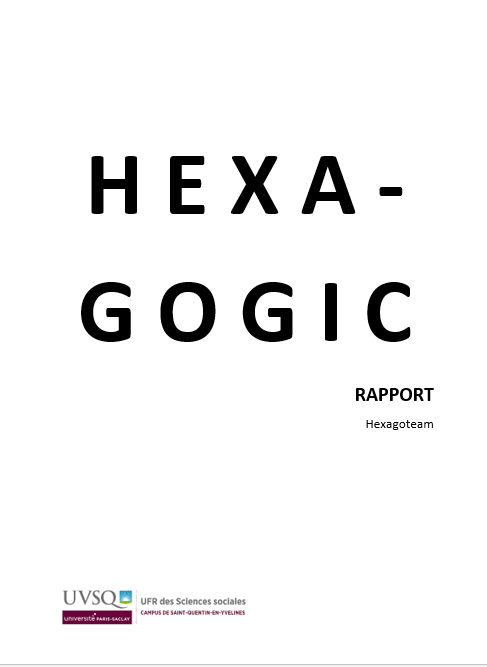

<div style="page-break-after: always"></div>

|**Projet Hexagogic**           |Version 1.2
|-------------------------------|-------------------|
|Document : Rapport de Projet   |Date : 15/12/2021
|Responsable de la rédaction : FLEURY CALAIS Pierre

# Projet Hexagogic

Le projet **Hexagogic** présenté par le présent rapport a été réaliser pour l'IUT de Vélizy, durant l'année scolaire 2021-2022 sous le tutorat de Alain Oster. L'équipe du projet est composée de BONIFACIO Timothé, CASALOTTI Celeste, FLEURY CALAIS Pierre et LEROY Camille.

Mail :
- camilleleroy004@gmail.com
- timo92.bonifacio@gmail.com
- pierrefcz@gmail.com
- kosin.alex@orange.fr

<div style="page-break-after: always"></div>

|**Projet Hexagogic**           |Version 1.2
|-------------------------------|-------------------|
|Document : Rapport de Projet   |Date : 15/12/2021
|Responsable de la rédaction : FLEURY CALAIS Pierre

# Remerciements

Nous tenons à remercier la soeur de Timothé qui nous a aidé pour la création des pages de gardes des rapports et du logo du jeu Hexagogic et surtout l'ensemble de l'équipe pédagogique de l'IUT Informatique de Vélizy pour leurs enseignements et leur bienveillance durant les deux années d'apprentissage mais aussi d'amusement autour de passions communes qui sont les domaines de l'informatique.

<div style="page-break-after: always"></div>

|**Projet Hexagogic**           |Version 1.2
|-------------------------------|-------------------|
|Document : Rapport de Projet   |Date : 15/12/2021
|Responsable de la rédaction : FLEURY CALAIS Pierre

# Table des matières

- Résumés <p style='text-align: right;'> **page 5** </p>
---
- Introduction <p style='text-align: right;'> **page 6** </p>
---
- Présentation de la solution proposée et de la démarche utilisée <p style='text-align: right;'> **page 7** </p>
---
- Analyse de la réalisation <p style='text-align: right;'> **page 9** </p>
---
- Conclusion et bilan du projet <p style='text-align: right;'> **page 10** </p>
---
- Bibliographie <p style='text-align: right;'> **page 11** </p>
---
- Annexes techniques <p style='text-align: right;'> **page 12** </p>
---

<div style="page-break-after: always"></div>

|**Projet Hexagogic**           |Version 1.2
|-------------------------------|-------------------|
|Document : Rapport de Projet   |Date : 15/12/2021
|Responsable de la rédaction : FLEURY CALAIS Pierre

# Résumé

## Français

Etant donnée l'absence de CASALOTTI Celeste, qui est la personne à l'origine du projet Hexagogic et la plus expérimenté en matière d'utilisation de la bibliothèque javafx, notre projet à mis du temps à démarrer et l'équipe à mis du temps à commencer à produire les premières lignes de code. C'est pour cette raison que le projet ne présente aujourd'hui qu'une interface graphique avec très peu d'interactions possibles. Cependant, une partie significative du travail est achevée et nous pensons pouvoir terminer le projet avant le début des stages

## Anglais

Given the absence of CASALOTTI Celeste, who is the origin of the Hexagogic project and the most experimented people in regard to use the javafx librarie, the project took time to begin et the team took time to produce first lines of code. This is why the project presents today only a graphical interface with few possible interactions. However, an important part of the project is achived and we think we will finish the project before the work experience.

<div style="page-break-after: always"></div>

|**Projet Hexagogic**           |Version 1.2
|-------------------------------|-------------------|
|Document : Rapport de Projet   |Date : 15/12/2021
|Responsable de la rédaction : FLEURY CALAIS Pierre

# Introduction

Le présent rapport a pour fonction de fournir des détails sur le déroulement du projet tutoré des semestres trois et quatre ainsi qu'une documentation concernant la conception du projet ainsi qu'un manuel utilisateur.

L'objectif du projet **Hexagogic** est de créer un jeu video éducatif reprenant les principes des circuits logiques vues dans les cours de logique élémentaires en première année d'IUT Informatique. Pour cela, nous avons décidé de créer une interface graphique avec une grille constituée d'hexagones et des opérations logiques, également de forme hexagonale.

En premier lieu le présent rapport présente la solution proposée ainsi que la démarche suivie, puis l'analyse de la réalisation du projet pour finir par la conclusion et le bilan du projet. Le rapport comporte aussi une bibliographie et un ensemble d'annexes techniques relatives aux projet.

L'équipe de développement du projet est constituée de **CASALOTTI Celeste**, qui est à l'origine de l'idée du projet, **FLEURY CALAIS Pierre**, désigné pour être le chef de projet, **BONIFACIO Timothé**, **KOSIN Alexandre** et **LEROY Camille**.

<div style="page-break-after: always"></div>

|**Projet Hexagogic**           |Version 1.2
|-------------------------------|-------------------|
|Document : Rapport de Projet   |Date : 15/12/2021
|Responsable de la rédaction : FLEURY CALAIS Pierre

# Présentation de la solution proposée et de la démarche utilisée

En raison de la complexité des différentes interactions avec l'interface que l'utilisateur devra accomplir nous avons décider de créer le jeu en utilisant l'interface javafx (voir le lien vers la documentation dans la Bibliographie). Étant donné qu'il s'agit d'un langage déjà utilisé par un seul membres du groupe, nous avons choisit de mener le projet et de concevoir le jeu selon une méthode agile.

Afin que toute l'équipe soit au courant en temps réel de l'avancée du projet, nous avons décider de mettre en place des sessions de travail en groupe. Cela permet également à chaque membre de l'équipe de participer aux différentes étapes de la réalisation du projet. Concernant le travail réalisé en dehors de ces sessions, nous nous sommes réparti les tâches à accomplir et faisions régulièrement le point sur les tâches accomplies ou à réaliser.

L'ensembles des risques, leurs degré de probabilité, leur degré de gravité ainsi que les solutions proposé sont listés dans les tableaux ci-dessous.


Afin de pouvoir assurer la communication entre les membres de l'équipe, un serveur Discord à été mis en place par LEROY Camille. Cela nous permet également d'échanger les travaux réalisés. Par la suite, notre client, OSTER Alain, à rejoint le serveur afin qu'il puisse être mis au courant en même temps que l'équipe de développement des réunions organisées en sa présence.

Le livrable se présente sous la forme d'un dossier contenant différents packages. Pour lancer le logiciel il faut ouvrir le projet dans un environnement de développement contenant la librairie JavaFX puis lancer le programme du fichier ```Controller.java```. 

<div style="page-break-after: always"></div>

|**Projet Hexagogic**           |Version 1.2
|-------------------------------|-------------------|
|Document : Rapport de Projet   |Date : 15/12/2021
|Responsable de la rédaction : FLEURY CALAIS Pierre

# Analyse de la réalisation

Actuellement, la solution proposée ne répond pas au problème posé et les exigences se sont pas toutes satisfaites car le projet n'est pas encore suffisamment avancé. Toutefois, les bases de l'interface graphique sont créées et l'équipe poursuit le développement afin de créer les différentes mécaniques du jeu vidéo.

<div style="page-break-after: always"></div>

|**Projet Hexagogic**           |Version 1.2
|-------------------------------|-------------------|
|Document : Rapport de Projet   |Date : 15/12/2021
|Responsable de la rédaction : FLEURY CALAIS Pierre

# Conclusion et Bilan du Projet

En raison des difficultés rencontrés les résultats obtenus sont inférieurs à ceux que l'on espérait. En effet, la majorité des exigences ne sont pas satisfaite et la mécanique du jeu n'a pas encore été créée.

Le projet sera donc amené à évoluer afin de pouvoir répondre aux exigences de notre client et d'en faire un jeu éducatif fonctionnel.

Ce projet nous a permis de découvrir une librairie graphique (JavaFX) avec de nouvelles possibilités qui nous étaient alors inconnues. Cependant, à cette étape du projet, les difficultés rencontrés tel que l'absence d'un membre important du groupe, nous ont retardé et ont eu des conséquences sur l'avancement de la création du jeu. Cela a également révélé des failles dans notre organisations et dans la gestion des imprévues.

<div style="page-break-after: always"></div>

# Bibliographie

https://docs.oracle.com/javase/8/javafx/api/toc.htm : **Documentation JavaFX**

http://www.infosetif.sitew.org/fs/ADO/96yc9-Chapitre_2.pdf : **Définition de Circuit logique**

https://refactoring.guru/design-patterns/state : **Design Pattern Etat**

<div style="page-break-after: always"></div>

# Annexes Technique
- Cahier des Charges <p style='text-align: right;'> **page 13** </p>
---
- Recueil des Besoins <p style='text-align: right;'> **page 15** </p>
---
- Dossier Conception <p style='text-align: right;'> **page 31** </p>
---
- Code Source <p style='text-align: right;'> **page 41** </p>
---

<div style="page-break-after: always"></div>


<div style="page-break-after: always"></div>

| Projet Hexagogic               |Version 1.0           |
|--------------------------------|----------------------|
| Document : Cahier des charges  |Date : 06/11/2021     |
| Responsable de la rédaction : FLEURY CALAIS Pierre    |


Ceci est le cahier des charges du projet de jeu vidéo **Hexagogic** à réaliser dans le cadre du projet tutoré de seconde année d'IUT informatique.

Il s'agit d'un jeu de logique comportant plusieurs niveaux. A chaque niveau, le jeu propose au joueur une variable initiale et une variable finale toute deux à des positions différentes dans une grille constituée d'hexagones. Le joueur dispose de plusieurs "tuiles" de forme hexagonales pouvant permettre l'affichage d'une variable à un moment donné ou représentant des opérations de logique élémentaire tel que AND, OR ou NAND ayant chacune plusieurs entrée et plusieurs sorties.
L'objectif du joueur est de positionner les différentes tuiles sur la grille pour constituer un circuit permettant de changer la variable initiale en variable de sortie.

Pour réaliser ce projet nous devons utiliser le langage java ainsi que le langage d'interface javafx, permettant ainsi des opération et manipulations que l'interface swing ne permet pas.

Des livrables seront régulièrement demandés par le client et le projet doit être terminé avant le début des stages en milieu professionnel.

<div style="page-break-after: always"></div>


<div style="page-break-after: always"></div>

# Table des Matières

- Chapitre 1 : Objectif et portée <p style='text-align: right;'> **page 3** </p>
---
- Chapitre 2 : Terminologie employée / Glossaire <p style='text-align: right;'> **page 4** </p>
---
- Chapitre 3 : Les Cas d'Utilisation <p style='text-align: right;'> **page 5** </p>
---
- Chapitre 4 : La Technologie employée <p style='text-align: right;'> **page 6** </p>
---
- Chapitre 5 : Autres exigences <p style='text-align: right;'> **page 7** </p>
---
- Annexes <p style='text-align: right;'> **page 9** </p>
---

<div style="page-break-after: always"></div>

| Projet Hexagogic                 | Version 1.0       |
|----------------------------------|-------------------|
| Document : Recueil des exigences | Date : 17/12/2021 |
|Responsable de la rédaction : Ensemble de l'équipe du projet hexagogic |

# Chapitre 1 : Objectif et portée

L'objectif est de créer un jeu video éducatif dont le but est de créer un système de circuit logique semblable à ceux que l'on peut observer dans des exercices de logique élémentaire.

Dans une première version le jeu sera sous la forme d'un programme exécutable.

Les personnes concernées sont donc l'ensemble des personnes pouvant s'échanger le code source du jeu.

<div style="page-break-after: always"></div>

| Projet Hexagogic                 | Version 1.0       |
|----------------------------------|-------------------|
| Document : Recueil des exigences | Date : 17/12/2021 |
|Responsable de la rédaction : Ensemble de l'équipe du projet hexagogic |

# Chapitre 2 : Terminologie employée / Glossaire

**Hexagoteam :** Surnom donné à l'équipe travaillant sur le projet hexagogic

**Tuile :** Forme hexagonale représentant une opération, une variable ou l'affichage d'une variable dans le circuit. Elles possèdent plusieurs entrées et plusieurs sorties.

**Grille :** Dans le jeu auquel se réfère la présente, il s'agit d'une grille constituée d'hexagones.

**Variable :** Les valeurs d'entrée et de sortie de chaque niveaux sont stockées dans des variables d'entrée et de sortie. La ou les variables d'entrée sont modifiées par le circuit et l'objectif du joueur est que la ou les valeurs en fin de circuit soient égales à la ou aux variables de sortie. Les différentes variables peuvent prendre les valeurs 0 ou 1 (true ou false).

**Expression :** Correspond à la valeur d'une variable en sortie d'une tuile.

**Circuit logique :** Un circuit logique réalise une ou plusieurs fonction logiques. Il est composé de portes logiques interconnectées entre elles (le lien de cette définition se trouve dans la bibliographie du rapport de projet). Il s'agit d'une notion de logique élémentaire vue en première année d'IUT informatique.

<div style="page-break-after: always"></div>

| Projet Hexagogic                 | Version 1.0       |
|----------------------------------|-------------------|
| Document : Recueil des exigences | Date : 17/12/2021 |
|Responsable de la rédaction : Ensemble de l'équipe du projet hexagogic |

# Chapitre 3 : Les Cas d'Utilisation

L'ensemble des Cas d'utilisation sont fournis en annexe. Il s'agit d'une liste qui sera complétée dans de futures version du recueil des besoins.

<div style="page-break-after: always"></div>

| Projet Hexagogic                 | Version 1.0       |
|----------------------------------|-------------------|
| Document : Recueil des exigences | Date : 17/12/2021 |
|Responsable de la rédaction : Ensemble de l'équipe du projet hexagogic |

# Chapitre 4 : La technologie employée

Les exigences technologiques que nous avons sont d’utiliser UML comme langage de conception avec le logiciel StarUML, Java et JavaFX pour la programmation du logiciel et de son interface graphique avec les IDE Eclipse et IntellliJ. 

<div style="page-break-after: always"></div>

| Projet Hexagogic                 | Version 1.0       |
|----------------------------------|-------------------|
| Document : Recueil des exigences | Date : 17/12/2021 |
|Responsable de la rédaction : Ensemble de l'équipe du projet hexagogic |

# Chapitre 5 : Autres exigences

Actuellement, il y a cinq membres faisant partie du projet : BONIFACIO Timothé ; CASALOTTI Celeste ; FLEURY CALAIS Pierre ; KOSIN Alexandre ; LEROY Camille. De plus, Monsieur OSTER Alain fait parti du projet en tant que client et commanditaire de celui-ci.

Après concertation avec le client, ainsi que les membre du groupe, nous avons décidé que les valeurs suivantes sont à privilégier :
- Nous désirons  que le projet ainsi que sa conception fasse preuve de souplesse pour qu'il puisse être modifiable selon la demande du client, ou selon les difficultés que nous pourrions rencontrer lors de l'implémentation des fonctionnalités.
- Nous souhaitions aussi rester disponibles et joignables entre les membres du groupe et avec M.OSTER.
- Enfin, nous voulions pouvoir faire preuve de réactivité face aux imprévus, de toutes nature qu'ils soient.

Il a été convenu avec le client que le projet devra être rendu à celui-ci sous la forme d'un livrable contenant un exécutable et/ou du code compilable en fonction de son avancement. Le commanditaire et les autres utilisateurs potentiels auront cet exécutable en plus du code source et pourront le voir et le modifier. En plus du rendu final, M.OSTER aura fréquemment un retour sur l'avancement ud projet via des réunion organisées collégiales.

Ce projet ne nécessite aucun achat de la part de l'équipe de développement mais en raison des technologies utilisées (voir Chapitre 4), nous devons faire l'acquisition de la librairie JavaFX. Afin de pouvoir réaliser les opérations logiques, il sera nécessaire de créer des listes de variables booléennes ainsi que des algorithmes pour les parcourir. 

Dans l'optique de la réalisation du projet, les membres du groupe vont devoir se former afin de pouvoir utiliser la librairie et interface JavaFX. Nous devons également l'installer sur nos environnement de développement respectifs afin de pouvoir l'utiliser.

Etant donné que le logiciel est destiné à être utilisé par des personnes jouant aux jeux video ou désirant progresser en logique, la seul règle métier à laquelle doit obéir le livrable final est d'être simple à utiliser tout en procurant de la satisfaction au joueur.

Les performances globales du jeu tel que sa rapidité sont variables en fonction de l'ordinateur utilisé. Toutefois, les algorithmes de parcours de liste de booleen serons créés de façon à limiter l'utilisation de la mémoire vive de l'ordinateur des utilisateurs.

Les opérations les plus courantes à réaliser sur le logiciel sont les rajouts de niveaux de jeu dans les fichiers du jeu. Pour cela, des dossiers seront créés contenant des fichiers textes indiquant les variables d'entré et de sortie ainsi que leur position pour chaque niveau.

L'utilisateur lance le programme, une fenêtre s'ouvre et il accède au menu du jeu. Il peut alors jouer au jeu en sélectionnant son niveau. Il peut également apprendre comment jouer grâce à un tutoriel sous la forme de texte explicatif avec des images.

Le jeu se présente avec des **tuiles**(voir chapitre 2) représentant des portes logiques que le joueur doit placer sur une **grille**(voir chapitre 2) pour créer un circuit logique et obtenir une **expression**(voir chapitre 2) en sortie de circuit égale à la valeur imposée par le jeu.

A l'heure de la rédaction de ce document, l'équipe cherche la meilleur façon de créer les structures de variables booléennes, de les parcourir ainsi que comment créer des niveaux à partir de fichiers texte.

<div style="page-break-after: always"></div>

| Projet Hexagogic                 | Version 1.0       |
|----------------------------------|-------------------|
| Document : Recueil des exigences | Date : 17/12/2021 |
|Responsable de la rédaction : Ensemble de l'équipe du projet hexagogic |

# Annexes

- Diagramme des Cas d'Utilisation <p style='text-align: right;'> **page 10** </p>
---
- Cas d'Utilisation - Niveau Stratégiques <p style='text-align: right;'> **page 11** </p>
---
- Cas d'Utilisation - Niveau Utilisateur <p style='text-align: right;'> **page 12** </p>
---

<div style="page-break-after: always"></div>

| Projet Hexagogic                 | Version 1.0       |
|----------------------------------|-------------------|
| Document : Recueil des exigences | Date : 17/12/2021 |
|Responsable de la rédaction : Ensemble de l'équipe du projet hexagogic |

# Diagramme des Cas d'Utilisation


<div style="page-break-after: always"></div>

| Projet Hexagogic                 | Version 1.0       |
|----------------------------------|-------------------|
| Document : Recueil des exigences | Date : 17/12/2021 |
|Responsable de la rédaction : Ensemble de l'équipe du projet hexagogic |

# Cas d'Utilisation - Niveau Stratégiques


<div style="page-break-after: always"></div>

| Projet Hexagogic                 | Version 1.0       |
|----------------------------------|-------------------|
| Document : Recueil des exigences | Date : 17/12/2021 |
|Responsable de la rédaction : Ensemble de l'équipe du projet hexagogic |

# Cas d'Utilisation - Niveau Utilisateur


<div style="page-break-after: always"></div>

| Projet Hexagogic                 | Version 1.0       |
|----------------------------------|-------------------|
| Document : Recueil des exigences | Date : 17/12/2021 |
|Responsable de la rédaction : Ensemble de l'équipe du projet hexagogic |


<div style="page-break-after: always"></div>

| Projet Hexagogic                 | Version 1.0       |
|----------------------------------|-------------------|
| Document : Recueil des exigences | Date : 17/12/2021 |
|Responsable de la rédaction : Ensemble de l'équipe du projet hexagogic |

# Cas d'Utilisation - Niveau Sous-fonction


<div style="page-break-after: always"></div>

| Projet Hexagogic                 | Version 1.0       |
|----------------------------------|-------------------|
| Document : Recueil des exigences | Date : 17/12/2021 |
|Responsable de la rédaction : Ensemble de l'équipe du projet hexagogic |


<div style="page-break-after: always"></div>

| Projet Hexagogic                 | Version 1.0       |
|----------------------------------|-------------------|
| Document : Recueil des exigences | Date : 17/12/2021 |
|Responsable de la rédaction : Ensemble de l'équipe du projet hexagogic |


<div style="page-break-after: always"></div>


<div style="page-break-after: always"></div>

# Table des Matières

- Introduction <p style='text-align: right;'> **page 3** </p>
---
- Spécification détaillé de la structure du système <p style='text-align: right;'> **page 4** </p>
---
- Spécification détaillé des interfaces utilisateur <p style='text-align: right;'> **page 5** </p>
---
- Choix des outils à utiliser <p style='text-align: right;'> **page 6** </p>
---
- Conclusion et points ouverts <p style='text-align: right;'> **page 7** </p>
---
- Annexes <p style='text-align: right;'> **page 8** </p>
---

<div style="page-break-after: always"></div>

|**Projet Hexagogic**                |Version 1.0
|------------------------------------|-------------------|
|Document : Dossier de conception    |Date : 16/12/2021
|Responsable de la rédaction : FLEURY CALAIS Pierre

# Introduction

Ce document est le dossier de concepteur du projet hexagogic. Il contient des explication sur la structure du code source du projet incluant un ou plusieurs diagrammes UML founis en annexe.

<div style="page-break-after: always"></div>

|**Projet Hexagogic**                |Version 1.0
|------------------------------------|-------------------|
|Document : Dossier de conception    |Date : 16/12/2021
|Responsable de la rédaction : FLEURY CALAIS Pierre

# Spécification détaillée de la structure du système

Remarque : 
- voir plus de détails sur les diagrammes UML présents en annexes
- pour toutes les références à la librairie JavaFX, voir la bibliographie du rapport de projet

La majorité des classes du logiciel sont contrôlées ou implémentées, directement ou indirectement par la classe ```Controller```. Celle-ci possède un attribut mainStage de type ```Stage``` ainsi que les méthodes ```start(Stage parStage)``` permettant de lancer la création de l'interface graphique, ```setMenuStage()``` et ```setGameStage()``` permettant respectivement la mise en place de la scène ```MenuScene``` et de la scène ```GameScene``` toutes deux héritant de la classe ```Scene```.

Toute les classe héritant de la classe ```Scene``` possèdent un attribut de type ```Controller``` ainsi qu'un attribut héritant de la classe ```BorderPane```. Ces classes comportent alors les différents éléments graphiques permettant les interactions avec l'utilisateur.

Le package modèle du projet comporte la classe ```LogicalCell``` possédant un attribut opération de type ```LogicalOperation```. Cette première est un prototype de la structure permettant la réalisation d'opérations semblables à celles des circuits logiques (voir Recueil des Besoins - Chapitre 2 : Glossaire).

<div style="page-break-after: always"></div>

|**Projet Hexagogic**                |Version 1.0
|------------------------------------|-------------------|
|Document : Dossier de conception    |Date : 16/12/2021
|Responsable de la rédaction : FLEURY CALAIS Pierre

# Spécification détaillée des intefaces utilisateur

Dans sa version final, l'interface de jeu aura au minimum les composants suivants :
- une colonne contenant les tuiles opérations qu'il est possible de placer.
- une grille hexagonale (voir Recueil de Besoins - Chapitre 2 : Glossaire) sur laquelle le joueur peut placer les tuiles d'opération avec des variables d'entrée prédéfinies.
- un bouton "Break" permettant d'accéder au menu du jeu.

L'interface de menu est constituée de différents boutons ayant différentes fonctions. Ils permettent de :
- Poursuivre le niveau en cours (RESUME)
- Recommencer le niveau en cours (RESTART)
- Sélectionner un niveau (SELECT LEVEL)
- Voir la page de tutoriel (TUTORIEL)
- Sélectionner le niveau suivant (NEXT LEVEL)
- Retourner au menu principal (MAIN MENU)
- Quitter le jeu et fermer la fenêtre graphique (EXIT)

Le bouton RESUME permet d'accéder au plateau de jeu. Celui ci présente une colonne à droite comportant des boutons pour sélectionner les opérations logiques. En bas ce trouve un bouton BREAK permettant de revenir au menu du jeu. Au milieu ce trouve la grille hexagonal constituant le plateau de jeu. Pour le moment, cliquer sur une tuile du plateau affiche la position de cette dernière dans la console.

Le bouton TUTORIEL permet de modifier la fenêtre pour visualiser les tables de vérité des différentes opérations logiques, ainsi qu'une notice d'utilisation du logiciel. On peut voir les différentes pages en utilisant les flèches en bas de fenêtre et revenir au menu principal avec le bouton MENU, également en bas de fenêtre.

Un prototype de circuit réalisable dans le jeu est disponible en annexe.

Les tuiles (voir Recueil de Besoins - Chapitre 2 : Glossaire) représentant la ou les variables d'entrée et celles représentants la ou les variables de sortie doivent avoir des couleurs différentes. En plus du nom de l'opération logique affiché en leur centre, les tuiles d'opérations doivent avoir chacune des couleurs qui diffèrent et qui sont différentes des tuiles d'entrée et de sortie.

<div style="page-break-after: always"></div>

|**Projet Hexagogic**                |Version 1.0
|------------------------------------|-------------------|
|Document : Dossier de conception    |Date : 16/12/2021
|Responsable de la rédaction : FLEURY CALAIS Pierre

# Choix des outils à utiliser

L'ensemble des éléments graphiques du logiciel doivent être codés avec en langage java avec la librairie JavaFX afin de ne pas créer de dysfonctionnement avec les classes déjà crées.

La structure permettant la réalisation des opérations logiques a été conçue selon une version adaptée au projet du Design Pattern Etat (voir bibliographie du rapport de projet). Cela permet d'ajouter de nouvelles opérations logiques en modifiant la méthode ```execute``` de la classe ```LogicalOperation``` sans changer le code de la classe ```LogicalCell```. Aussi, grâce à ce Design Pattern, les opérations des cellules diffèrent en fonction du nom de l'instance de la classe ```LogicalOperation```. Cette structure est conçu selon le modèle d'une liste chaînée avec des cellules possédant deux "cellules suivantes" afin de pouvoir créer un bifurcation dans le circuit logique.

<div style="page-break-after: always"></div>

|**Projet Hexagogic**                |Version 1.0
|------------------------------------|-------------------|
|Document : Dossier de conception    |Date : 16/12/2021
|Responsable de la rédaction : FLEURY CALAIS Pierre

# Conclusion et point ouverts

Actuellement, l'équipe de projet n'a pas encore conçu la mécanique du jeu. En effet, la librairie utilisé n'est que peu connue au sein du groupe et la concevoir prend donc du temps. Une documentation sur celle-ci sera donc fournie dans de futures version du dossier concepteur.

<div style="page-break-after: always"></div>

|**Projet Hexagogic**                |Version 1.0
|------------------------------------|-------------------|
|Document : Dossier de conception    |Date : 16/12/2021
|Responsable de la rédaction : FLEURY CALAIS Pierre

# Annexes

- Annexes 1 : Prototype de circuit <p style='text-align: right;'> **page 9** </p>
---
- Annexes 2 : Diagramme UML <p style='text-align: right;'> **page 10** </p>
---

<div style="page-break-after: always"></div>

|**Projet Hexagogic**                |Version 1.0
|------------------------------------|-------------------|
|Document : Dossier de conception    |Date : 16/12/2021
|Responsable de la rédaction : FLEURY CALAIS Pierre

# Annexe 1 : Prototype de circuit


<div style="page-break-after: always"></div>

|**Projet Hexagogic**                |Version 1.0
|------------------------------------|-------------------|
|Document : Dossier de conception    |Date : 16/12/2021
|Responsable de la rédaction : FLEURY CALAIS Pierre

# Annexe 2 : Diagramme UML


Pour obtenir le diagramme au format mdj veuillez envoyer un mail à un membre de l'Hexagoteam. Les contacts sont en première partie du rapport de projet.

<div style="page-break-after: always"></div>

| Projet Hexagogic               |Version 1.0           |
|--------------------------------|----------------------|
| Document : Code source         |Date : 17/12/2021     |
| Responsable de la rédaction : FLEURY CALAIS Pierre    |

# Code Source

Les classes de code source actuellement réalisées sont présentées dans l'ordre suivant :
- ```Controller.java```
- ```LogicalCell.java```
- ```LogicalOperation.java```
- ```RadioOperationButton.java```
- ```ButtonMenu.java```
- ```GameScene.java```
- ```MenuScene.java```
- ```OptionPane.java```
- ```TileOperationPane.java```

<div style="page-break-after: always"></div>

| Projet Hexagogic               |Version 1.0           |
|--------------------------------|----------------------|
| Document : Code source         |Date : 15/12/2021     |
| Responsable de la rédaction : FLEURY CALAIS Pierre    |

```java
package sample;

import javafx.application.Application;
import javafx.scene.control.Button;
import javafx.scene.layout.*;

import javafx.stage.*;

import tmp.MenuPane;
import view.GameScene;
import view.MenuScene;
import view.OptionPane;
import view.TileOperationPane;

/**
 * class Controller extends Application
 * @author FLEURY CALAIS Pierre
 */
public class Controller extends Application {
    int c=0; //unknow fonction
    private Stage mainStage = new Stage();

    /**
     * Method getMainStage
     * @return Stage
     */
    public Stage getMainStage() {
        return mainStage;
    }

    /**
     * Method static main
     * @param args String []
     */
    public static void main(String[] args) {
        launch(args);
    }

    @Override
    public void start(Stage stage) throws Exception {
        this.setMenuStage();
    }

    /**
     * Method setMenuStage throws Exception
     */
    public void setMenuStage() {
        mainStage.setTitle("Hexagogic");
        MenuPane menuPane = new MenuPane(this);
        MenuScene menuScene = new MenuScene(this, menuPane, 800, 600);
        mainStage.setScene(menuScene);
        mainStage.show();
    }

    public void setGameStage() {
        String [] opeList = {"AND", "OR"} ;
        TileOperationPane tileOpe = new TileOperationPane(opeList, this);
        BorderPane gamePane = new BorderPane();
        gamePane.setRight(tileOpe);
        OptionPane optionPane = new OptionPane(this);
        gamePane.setBottom(optionPane);
        GameScene gameScene = new GameScene(this, gamePane,800, 600);
        mainStage.setScene(gameScene);
        mainStage.show();
    }

}
```

<div style="page-break-after: always"></div>

| Projet Hexagogic               |Version 1.0           |
|--------------------------------|----------------------|
| Document : Code source         |Date : 15/12/2021     |
| Responsable de la rédaction : FLEURY CALAIS Pierre    |

```java
package modele;

import java.util.ArrayList;

/**
 * class LogicalCell
 * @author FLEURY CALAIS Pierre
 */
public class LogicalCell {
    private LogicalOperation operation;
    private ArrayList <Boolean> input = new ArrayList<Boolean>();
    private LogicalCell nextCell1 = null;
    private LogicalCell nextCell2 = null;

    /**
     * Method setOperation
     * @param parOpeName String
     */
    public void setOperation(String parOpeName) {
        operation = new LogicalOperation(parOpeName);
    }

    /**
     * Method setOperation
     * @param parOpe LogicalOperation
     */
    public void  setOperation(LogicalOperation parOpe) {
        operation = parOpe;
    }

    /**
     * Method setInput
     * @param parInput boolean
     */
    public void addInput(Boolean parInput) {
        if (input.size()<2) {
            input.add(parInput);
        }
    }

    /**
     * Method setnextCell1
     * @param parCell LogicalCell
     */
    public void setNextCell1(LogicalCell parCell) {
        nextCell1 = parCell;
    }

    /**
     * Method setNextell2
     * @param parCell LogicalCell
     */
    public void setNextCell2(LogicalCell parCell) {
        this.nextCell2 = parCell;
    }

    /**
     * Method hasNextCell1
     * @return boolean
     */
    public boolean hasNextCell1() {
        if (nextCell1 !=null) {
            return true;
        }
        return false;
    }

    /**
     * Method hasNextCell2
     * @return boolean
     */
    public boolean hasNextCell2() {
        if (nextCell2 !=null) {
            return true;
        }
        return false;
    }

    /**
     * Method nextCell1
     * @return LogicalCell
     */
    public LogicalCell nextCell1() {
        return nextCell1;
    }

    /**
     * Method nextCell2
     * @return LogicalCell
     */
    public LogicalCell nextCell2() {
        return nextCell2;
    }

    /**
     * Method getOut
     * @return Boolean
     */
    public Boolean getOut() {
        return operation.execute(input.get(0), input.get(1));
    }

}

```

<div style="page-break-after: always"></div>

| Projet Hexagogic               |Version 1.0           |
|--------------------------------|----------------------|
| Document : Code source         |Date : 17/12/2021     |
| Responsable de la rédaction : FLEURY CALAIS Pierre    |

```java
package modele;

/**
 * Class LogicalOperation
 * @author Hexagoteam
 */
public class LogicalOperation {
    public String name;

    /**
     * Constructor LogicalOperation
     * @param parName String
     */
    public LogicalOperation(String parName) {
        name = parName;
    }

    /**
     * Method execute
     * @param v1 Boolean
     * @param v2 Boolean
     * @return boolean
     */
    public boolean execute(Boolean v1, Boolean v2) {
        switch (name) {
            case "AND" : return v1 && v2;
            case "OR" : return v1 || v2;
            default: return v1;
        }
    }

}

```

<div style="page-break-after: always"></div>

| Projet Hexagogic               |Version 1.0           |
|--------------------------------|----------------------|
| Document : Code source         |Date : 15/12/2021     |
| Responsable de la rédaction : FLEURY CALAIS Pierre    |

```java
package modele;

import javafx.scene.control.RadioButton;

/**
 * Class RadioOperationButton extends RadioButton
 * @author FLEURY CALAIS Pierre
 */
public class RadioOperationButton extends RadioButton {
    private String name;

    /**
     * Constructor RadioOperationButton
     * @param parName String
     */
    public RadioOperationButton(String parName) {
        super(parName);
        name = parName;
    }

    /**
     * Method toString
     * @return String
     */
    public String toString() {
        return name;
    }

}
```

<div style="page-break-after: always"></div>

| Projet Hexagogic               |Version 1.0           |
|--------------------------------|----------------------|
| Document : Code source         |Date : 15/12/2021     |
| Responsable de la rédaction : FLEURY CALAIS Pierre    |

```java
package view;

import javafx.geometry.Pos;
import javafx.scene.layout.StackPane;
import javafx.scene.paint.Color;
import javafx.scene.shape.Rectangle;
import javafx.scene.text.Font;
import javafx.scene.text.Text;

public class ButtonMenu extends StackPane{
	
	public ButtonMenu(String name){
		Text text = new Text(name);
		text.setFont(Font.font(20));
		text.setFill(Color.BLACK);
		
		Rectangle rectangle = new Rectangle(300,30);
		rectangle.setFill(Color.RED);
		
		getChildren().addAll(rectangle, text);
		
		setOnMouseEntered(event -> {
			rectangle.setFill(Color.BLUE);
			text.setFill(Color.WHITE);
		});
		
		setOnMouseExited(event -> {
			rectangle.setFill(Color.RED);
			text.setFill(Color.BLACK);
		});
		
		this.setTranslateX(375);
		this.setTranslateY(50);
	}
}
```

<div style="page-break-after: always"></div>

| Projet Hexagogic               |Version 1.0           |
|--------------------------------|----------------------|
| Document : Code source         |Date : 15/12/2021     |
| Responsable de la rédaction : FLEURY CALAIS Pierre    |

```java
package view;

import javafx.scene.Parent;
import javafx.scene.Scene;
import javafx.scene.layout.BorderPane;
import sample.Controller;

/**
 * Class GameScene
 * @author FLEURY CALAIS Pierre
 */
public class GameScene extends Scene {
    BorderPane gamePane;
    Controller controller;

    /**
     * Constructor GameScene
     * @param parController Controller
     * @param parGamePane BorderPane
     * @param parHigh int
     * @param parWidth int
     */
    public GameScene(Controller parController, BorderPane parGamePane, int parHigh, int parWidth) {
        super(parGamePane, parHigh, parWidth);
        gamePane = parGamePane;
        controller = parController;
    }

}
```

<div style="page-break-after: always"></div>

| Projet Hexagogic               |Version 1.0           |
|--------------------------------|----------------------|
| Document : Code source         |Date : 15/12/2021     |
| Responsable de la rédaction : FLEURY CALAIS Pierre    |

```java
package view;

import javafx.scene.Scene;
import sample.Controller;
import tmp.MenuPane;

/**
 * Class MenuScene
 * @author FLEURY CALAIS Pierre
 */
public class MenuScene extends Scene {
    Controller controller;
    MenuPane menuPane;

    /**
     * Constructor MenuScene
     * @param parController Controller
     * @param parMenuPane MenuPane
     * @param parHigh int
     * @param parWidth int
     */
    public MenuScene(Controller parController, MenuPane parMenuPane, int parHigh, int parWidth) {
        super(parMenuPane, parHigh, parWidth);
        controller = parController;
        menuPane = parMenuPane;
    }

}
```

<div style="page-break-after: always"></div>

| Projet Hexagogic               |Version 1.0           |
|--------------------------------|----------------------|
| Document : Code source         |Date : 15/12/2021     |
| Responsable de la rédaction : FLEURY CALAIS Pierre    |

```java
package view;

import javafx.scene.control.Button;
import javafx.scene.layout.BorderPane;
import javafx.scene.layout.Pane;
import sample.Controller;

/**
 * Class MenuPane
 * @author FLEURY CALAIS Pierre
 */
public class OptionPane extends BorderPane {
    Controller controller;
    Button breakButton = new Button("Break");

    /**
     * Constructor MenuPane
     * @param parController Controller
     */
    public OptionPane(Controller parController) {
        controller = parController;
        breakButton.setOnMouseClicked( event ->
                controller.setMenuStage());
        this.setRight(breakButton);
    }

}
```

<div style="page-break-after: always"></div>

| Projet Hexagogic               |Version 1.0           |
|--------------------------------|----------------------|
| Document : Code source         |Date : 15/12/2021     |
| Responsable de la rédaction : FLEURY CALAIS Pierre    |

```java
package view;

import javafx.scene.control.ToggleGroup;
import javafx.scene.layout.TilePane;

import modele.RadioOperationButton;
import sample.*;

/**
 * class TileOperationPane extends TilePane
 * @author FLEURY CALAIS Pierre
 */
public class TileOperationPane extends TilePane {
    ToggleGroup radioGroup = new ToggleGroup();
    Controller controller;

    /**
     * Constructor TileOperationPane
     * @param listOpe String []
     */
    public TileOperationPane(String [] listOpe, Controller parController) {
        super();
        controller = parController;
        for (int i=0 ; i<listOpe.length ; i++) {
            RadioOperationButton opeButton = new RadioOperationButton(listOpe[i]);
            opeButton.setToggleGroup(radioGroup);
            this.getChildren().add(opeButton);
        }
    }

    /**
     * Method getSelectedOperation
     * @return String
     */
    public String getSelectedOperation() {
        return this.radioGroup.getSelectedToggle().toString();
    }

}
```